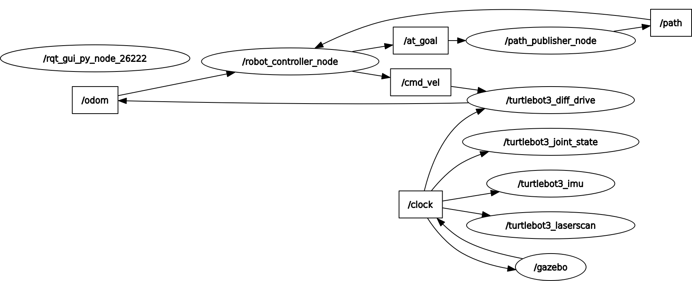
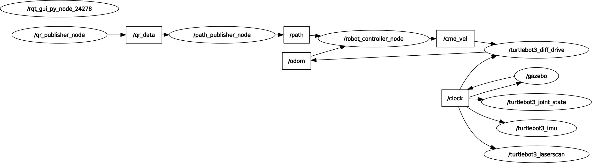

# SLAM-Based Exploration for Stigmergy Path Planning Using TurtleBot3 Burger

Extends a two-robot stigmergy system in ROS2 Gazebo. In the original system, robot one uses RRT# on a known map and saves its path as a QR code with a 25 character limit, and robot two reads the QR code and follows the stored path to its end. This version removes the known map: robot one starts with no map, builds one with slam_toolbox, explores toward the goal using frontier search and A*, and saves its final path as a QR code once it arrives.

The original known-map system was ported from a master's thesis into ROS2 during research at UMD's Motion and Teaming Lab ([BurgerBot3-QR](https://github.com/George-Peregoy/BurgerBot3-QR)). The SLAM exploration (the `_c` files) was done separately on my own. The original simulation is kept here as a baseline.

## Requirements

- Ubuntu 22.04
- ROS2 Humble
- Python 3.10
- TurtleBot3 Gazebo packages, slam_toolbox
- System packages: `libzbar0`

## Installation

### 1. Clone repository

**HTTPS:**
```bash
git clone https://github.com/George-Peregoy/slam_burger.git
cd slam_burger
```

**SSH:**
```bash
git clone git@github.com:George-Peregoy/slam_burger.git
cd slam_burger
```

### 2. Install System Dependencies
```bash
sudo apt-get update
sudo apt-get install libzbar0
```

### 3. Install Python Dependencies
```bash
pip install -r requirements.txt
```

### 4. Build the Workspace
```bash
cd ~/slam_burger
colcon build
source install/setup.bash
```

## Package Structure

The workspace is split into three packages. Path planning handles frontier search, A*, RRT#, path pruning, and reading/saving QR data. Controller subscribes to the path and publishes cmd_vel. Simulation handles the launch files, converting the 2D obstacles into stl files, and combining the stl files into a world file. Files ending in `_c` are the SLAM version, files without a suffix are the original known-map version.

### path_planning

```bash
.
├── environments/
├── path_planning
│   ├── astar.py
│   ├── config.py
│   ├── ellipses2.py
│   ├── gen_obstacles.py
│   ├── path_pruning_c.py
│   ├── path_pruning.py
│   ├── path_to_qr.py
│   ├── pose_publisher_1c.py
│   ├── pose_publisher_1.py
│   ├── pose_publisher_2.py
│   ├── qr_reader_node.py
│   ├── rrtsharp_c.py
│   └── rrtsharp.py
├── qrcodes/
├── package.xml
└── setup.py
```

**Nodes:**

- `pose_publisher_1c.py` - SLAM exploration. Uses frontier search and A* to reach the goal on the live map, then plans a final path with RRT# and saves it as a QR code.
- `pose_publisher_1.py` - Uses RRT# on the known map, publishes /path as nav_msgs/msg/Path, saves QR code to src/path_planning/qrcodes/.
- `pose_publisher_2.py` - Subscribes to /qr_data, converts data to nav_msgs/msg/Path, publishes /path.
- `qr_reader_node.py` - Reads QR code, publishes path as string.

**Utilities:**

- `astar.py` - A* path planning on an occupancy grid with an optional cost map.
- `rrtsharp_c.py` - RRT# on the SLAM /map, used for the final QR path.
- `path_pruning_c.py` - Path pruning and QR compression on the SLAM /map.
- `rrtsharp.py` - RRT# on the known map.
- `path_pruning.py` - Prunes path by line of sight, then if needed prunes using ellipses.
- `ellipses2.py` - Defines ellipse object, handles ellipse sampling.
- `path_to_qr.py` - Converts a list of points to a string to be saved as a QR code.
- `gen_obstacles.py` - Generates 2D environment, saves to src/path_planning/environments.

### controller

```bash
.
├── controller
│   ├── __init__.py
│   ├── robot_controller_c.py
│   └── robot_controller.py
├── package.xml
└── setup.py
```

**Nodes:**

- `robot_controller_c.py` - Subscribes to /path and odometry, publishes geometry_msgs/msg/Twist to /cmd_vel. Publishes /at_end when a path is finished so robot one knows to pick a new frontier.
- `robot_controller.py` - Subscribes to /path, publishes geometry_msgs/msg/Twist to /cmd_vel. Used by the original version.

### simulation

```bash
.
├── launch
│   ├── launch_robot_1c.py
│   ├── launch_robot_1.py
│   └── launch_robot_2.py
├── meshes/
├── rviz/
├── simulation
│   ├── env_to_world.py
│   ├── gen_world.py
│   └── __init__.py
├── worlds/
├── package.xml
└── setup.py
```

**Launch Files:**

- `launch_robot_1c.py` - Starts robot 1 SLAM simulation with slam_toolbox and RViz.
- `launch_robot_1.py` - Starts robot 1 original simulation.
- `launch_robot_2.py` - Starts robot 2 original simulation.

All launch files accept the world number as a launch argument, `world_num:=0`.

**Utilities:**

- `env_to_world.py` - Converts 2D obstacles into mesh files, combines mesh files into a single world file. Saves meshes to src/simulation/meshes/ and worlds to src/simulation/worlds/.
- `gen_world.py` - Generates random obstacles for the 2D environment and converts them to world files for the 3D simulation.

## Configuration

Key global variables in src/path_planning/config.py

- `ENV_X_BOUNDS = (0, 20)` - Environment X bounds (grid units)
- `ENV_Y_BOUNDS = (0, 20)` - Environment Y bounds (grid units)
- `START = (5, 5)` - Robot 1 start / Robot 2 goal (grid units)
- `GOAL = (15, 15)` - Robot 2 start / Robot 1 goal (grid units)
- `ROBOT_RADIUS = 0.105` - TurtleBot3 Burger radius (meters)
- `BUFFER = 0.125` - Total obstacle clearance (meters)
- `WORLD_SCALE = 0.1` - Conversion: meters per grid cell
- `STEP_SIZE = 2` - RRT# branch length (grid units)
- `CHAR_LIMIT = 25` - Max QR code characters (alphanumeric)

## Usage

To generate worlds run `python3 src/simulation/simulation/gen_world.py`. It is set to generate five random worlds. After running this you must use `colcon build` to save the worlds to the workspace.

To launch the SLAM version run `ros2 launch simulation launch_robot_1c.py world_num:=0`.

To launch the original version run `ros2 launch simulation launch_robot_1.py world_num:=0` for robot 1, then `ros2 launch simulation launch_robot_2.py world_num:=0` for robot 2.

The world_num argument is optional and defaults to 0.

## How it works

### Environment generation

The environment uses randomly generated Polygons from shapely. The obstacles are converted to an stl file by breaking up the vertices and creating a series of connected triangles. These triangles are combined into a single mesh to represent an obstacle. The meshes match the 2D obstacles but are extruded a constant one meter, and are then combined into a single world file.

### Robot 1 (SLAM)

Robot one starts with no map. slam_toolbox builds the map from the lidar as it moves. Every time the map updates, three versions of it are made:

- A navigation map, obstacles inflated by the robot radius rounded down. A* uses this for collision checking.
- A conservative map, obstacles inflated by the robot radius rounded up. Used for picking frontier goals and line of sight pruning so they keep a margin from walls.
- A cost map with a penalty that decays away from obstacles. A* adds this to its costs so paths stay away from walls when they can.

A frontier is a free cell next to an unknown cell. Frontier cells are grouped into clusters, and each cluster is scored so that clusters closer to the goal, closer to the robot, and larger are preferred. Distance to the goal is weighted the most, so the robot explores toward the goal instead of mapping everything. If the goal is already mapped and free, the robot plans straight to it.

A* plans to the chosen frontier. Unknown cells are treated as free in A* so it can plan into unexplored space, but line of sight pruning treats unknown as an obstacle so it never shortcuts through space it hasn't seen. While driving, the path is rechecked against every new map. If a new obstacle blocks it, the robot stops and picks a new frontier.

Once at the goal, robot one runs RRT# on the finished map and saves the path as a QR code using the same pruning as the original version.

### Robot 1 (original)

Robot one uses RRT# on the known map to get a path from start to goal. Once it reaches the goal it converts its path into an alphanumeric QR code. The QR code must be 25 characters or less, so if the path is too long the robot uses line of sight pruning, and if needed ellipse pruning.

### Robot 2 (original)

Robot two has no information on the environment. It reads the QR code using pyzbar and follows the path exactly. If there is an ellipse in the path, robot two uses RRT# to patch the ellipse and continues until it reaches the goal.

## Architecture Diagram

These are the ROS2 rqt graphs for each robot in the original RRT# simulation.

### Robot 1



*Figure 1: Node communication topology showing Robot 1 architecture*

### Robot 2



*Figure 2: Node communication topology showing Robot 2 architecture*

## Limitations

- Robot two is not implemented for the SLAM version yet.
- Frontier scoring weights were tuned by hand.
- Simulation only.